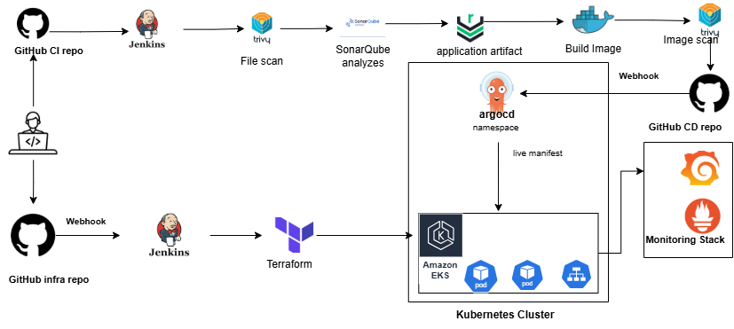

# 🚀 Enterprise DevSecOps & GitOps Platform on AWS EKS

### *Jenkins • Terraform • ArgoCD • SonarQube • Nexus • Trivy • Kubernetes • Prometheus • Grafana*

---

## 🧭 Overview

This project implements a **production-grade DevSecOps and GitOps platform** that automates the entire software delivery lifecycle, from code commit to secure deployment on Kubernetes.

It demonstrates how modern engineering teams build **scalable, secure, cloud-native systems** using industry best practices.

---

## 💼 Business Value

This platform is designed to solve real-world engineering challenges:

* ⚡ **Accelerated delivery** through fully automated CI/CD pipelines
* 🔐 **Improved security posture** with integrated DevSecOps controls
* 🔁 **Deployment consistency** using GitOps principles
* 📦 **Standardized infrastructure** with Infrastructure as Code
* 📊 **Enhanced observability** for faster incident response

### 📌 Ideal Use Cases

* SaaS platforms
* Banking & financial applications
* Microservices architectures
* Cloud-native modernization
* DevSecOps transformations

---

## 🏗️ Architecture Overview

The platform is built around three coordinated pipelines:

### 🔹 CI Pipeline (Continuous Integration)

Powered by Jenkins:

* GitHub source integration
* Automated build, test, and security scanning
* Static analysis with SonarQube
* Vulnerability scanning using Trivy
* Artifact management with Nexus
* Docker image build and scan

---

### 🔹 CD Pipeline (GitOps Deployment)

Driven by ArgoCD:

* Declarative Kubernetes manifests
* Continuous synchronization with Git
* Automated rollbacks and drift detection

---

### 🔹 Infrastructure Pipeline (IaC)

Built using Terraform on Amazon Web Services:

* VPC, networking, IAM
* EKS cluster provisioning
* Node groups and scaling
* Remote state management

---

## 🖼️ Architecture Diagram

https://github.com/hamoud31/gitops-devsecops-jenkins/blob/main/docs/images/architecture.png



---

## 🔄 End-to-End Workflow

1. Developer pushes code to GitHub
2. Jenkins triggers CI pipeline
3. Application is tested, scanned, and built
4. Docker image is created and scanned with Trivy
5. Kubernetes manifests are updated
6. Changes are committed to Git
7. ArgoCD deploys to EKS
8. Monitoring via Prometheus and Grafana

---

## 🔐 DevSecOps Integration

| Stage | Tool      | Description                        |
| ----- | --------- | ---------------------------------- |
| Code  | SonarQube | Static analysis with quality gates |
| Build | Trivy     | Dependency & filesystem scan       |
| Image | Trivy     | Container vulnerability scan       |
| CD    | ArgoCD    | Secure GitOps deployment           |
| IaC   | Terraform | Infrastructure validation          |

---

## ⚙️ Key Features

### ✅ CI/CD Automation

* Fully automated pipeline with Jenkins
* Continuous testing and validation
* Artifact versioning and image scanning

### ✅ GitOps Deployment

* Declarative Kubernetes deployments
* Automatic synchronization with cluster
* Rollback and drift detection

### ✅ Kubernetes Production Setup

Using Kubernetes:

* Multi-tier application deployment
* Stateful database with persistence
* Ingress-based routing

### ✅ Infrastructure as Code

* AWS provisioning via Terraform
* Modular architecture
* Remote backend state

### ✅ Observability & Monitoring

Using Prometheus and Grafana:

* Metrics collection
* Real-time dashboards
* Resource usage tracking

---

## 📈 Performance & Results

* 🚀 Deployment time reduced: **30 min → 5 min**
* 🔄 Zero-downtime deployments using rolling updates
* 🛡️ Early vulnerability detection: **>90% before production**
* ⚡ Infrastructure provisioning: **< 15 minutes**

---

## 📊 Monitoring Stack

* Prometheus
* Grafana
* Node Exporter
* Kube State Metrics

Provides insights on:

* CPU / Memory usage
* Pod health & scaling
* Application latency
* Database performance

---

## 📁 Repository Structure

```
gitops-devsecops-jenkins/
│── Jenkinsfile
│── Multi-Tier-BankApp/
│── eks-infra-iac/
│── k8s-manifests/
│── docs/
└── README.md
```

---

## ⚡ Challenges & Engineering Solutions

### 🔸 Secure CI/CD Pipeline

Integrated Trivy and SonarQube with enforced quality gates

### 🔸 Environment Drift

Solved using GitOps with ArgoCD

### 🔸 Infrastructure Reproducibility

Terraform with remote state

### 🔸 Scalability & Reliability

Kubernetes autoscaling and rolling updates

---
## 🖼️ Demo & Proof (Screenshots)

### 🔹 CI Pipeline – Jenkins
https://github.com/hamoud31/gitops-devsecops-jenkins/blob/main/docs/images/jenkins-pipeline.png

---

### 🔹 Code Quality – SonarQube
https://github.com/hamoud31/gitops-devsecops-jenkins/blob/main/docs/images/sonarqube-dashboard.png

---

### 🔹 Nexus – Repository

---
https://github.com/hamoud31/gitops-devsecops-jenkins/blob/main/docs/images/Nexus-repository.png

---

### 🔹 GitOps Deployment – ArgoCD
https://github.com/hamoud31/gitops-devsecops-jenkins/blob/main/docs/images/argocd-sync.png

---

### 🔹 Monitoring – Grafana
https://github.com/hamoud31/gitops-devsecops-jenkins/blob/main/docs/images/grafana-dashboard.png

---

### 🔹 Monitoring – Prometheus
https://github.com/hamoud31/gitops-devsecops-jenkins/blob/main/docs/images/Prometheus-dashboard.png

---

### 🔹 “Access Application via Browser
https://github.com/hamoud31/gitops-devsecops-jenkins/blob/main/docs/images/app.png

---

### 🔹Infrastructure Used in This Project
https://github.com/hamoud31/gitops-devsecops-jenkins/blob/main/docs/images/Infra-project.png

---

### 🔹EKS infra provision
https://github.com/hamoud31/gitops-devsecops-jenkins/blob/main/docs/images/eks-infra.png

---

## 🧠 Skills Demonstrated

* CI/CD pipeline design
* GitOps workflows
* Kubernetes production architecture
* Infrastructure as Code (Terraform)
* AWS cloud engineering
* DevSecOps practices
* Monitoring & observability

---

## 💰 Freelance & Real-World Applications

This platform can be adapted for:

* CI/CD implementation
* Kubernetes migration
* DevSecOps transformation
* AWS infrastructure automation

---

## 🤝 Available for Freelance

I help companies:

* Build CI/CD pipelines
* Migrate to Kubernetes
* Implement DevSecOps practices
* Automate AWS infrastructure

Available on:

* Upwork
* Malt

---

## 🚀 Getting Started

### Prerequisites

* AWS account
* Docker
* Terraform
* kubectl
* Jenkins
* GitHub

### 1. Provision Infrastructure

```
cd eks-infra-iac
terraform init
terraform apply
```

### 2. Configure CI Pipeline

* Setup Jenkins
* Configure credentials
* Connect repositories

### 3. Trigger Pipeline

Push code → pipeline runs automatically

### 4. GitOps Deployment

ArgoCD deploys to Kubernetes

---

## 🏁 Conclusion

This project demonstrates a complete **enterprise-grade DevSecOps platform**, combining:

* Cloud infrastructure
* Kubernetes orchestration
* CI/CD automation
* GitOps delivery
* Security practices
* Observability

---

## 📌 Author

**Hamoud – AWS DevOps Engineer**
Specialized in cloud automation, Kubernetes, and DevSecOps
